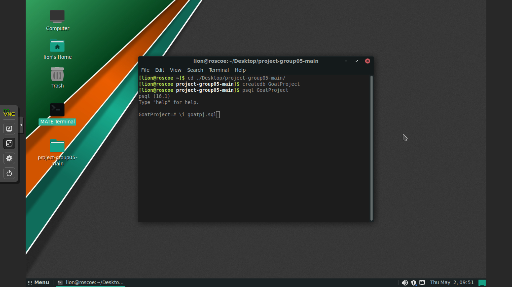
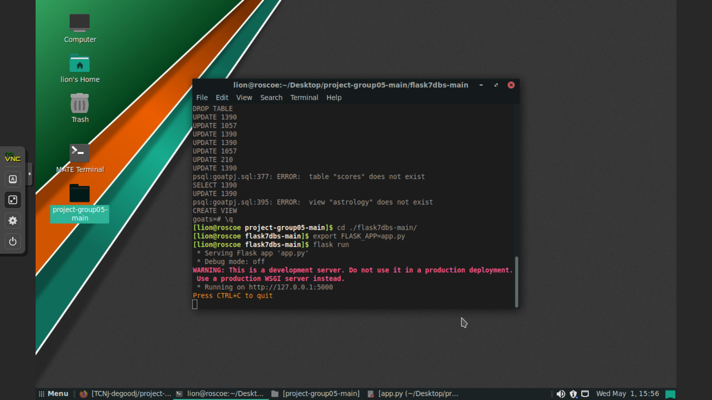
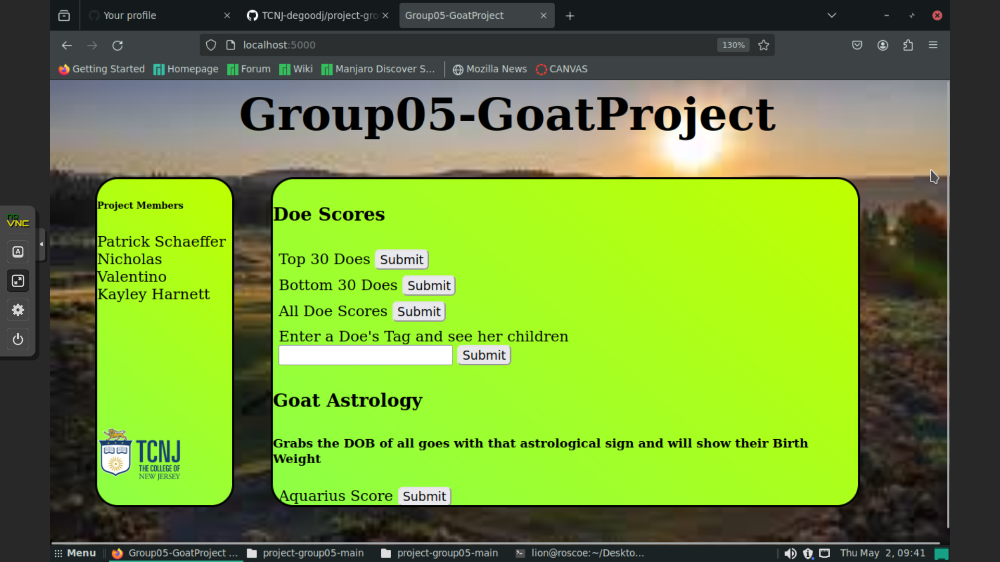

# Mother Goat and astrology scores

## Description

We built a database to take the data collected by Silvies Valley Ranch, on their goats, and build a database around it to score each mother and kid on a variety of data.

## Installation

Open your terminal and change your directory to the folder project-group05-main

Now load the data from the file but first we need to create a new database 
run the command:
createdb GoatProject
run psql by running the command 
psql GoatProject
now do \i goatpj.sql

you should see the screen with pleny of creates, updates and a few warnings but don't worry it's the first time loading the data
press \q to exit the database

Now we go on to loading up the flask app for our GUI
once your not running psql in the terminal we have do go to the flask directory

enter: 
\
cd ./flask7dbs-main
\
export FLASK_APP=app.py
\
flask run

Then enter the following commands into the command propt to load up the GUI

now open the link in a browser of your choice, we are using firefox, and then the GUI will be loaded

have fun and look around

All of our data scored the goats so see whcih ones are the best. The top part of our GUI will load our preloaded queries and your able to find the children of a mother by her tag
the very botom if you know your SQL we have 3 tables that you should look at (mom, kid and child).

## Usage
To use the application is very simple after getting it running. Each of the buttons on the webpage will bring to a chart of their data. Entering a Does tag and hitting submit will show her kids, and at the bottom custom queries can be added.

## Tests
These are some tests for at the bottom where you can enter commands. CAREFUL - commands can be subject to SQL injection

To look at each specific aspect of the mother score you can use the mother you can use SELECT * FROM MOM;

Or if you want to check a specifically kid with tag '17151's score use SELECT * FROM KID WHERE KID.tag = '17154';

## Credits
Nick Valentino
https://github.com/Nickval27

Patrick Schaeffer
https://github.com/patschaef

Kayley Harnett
https://github.com/harnettkay
